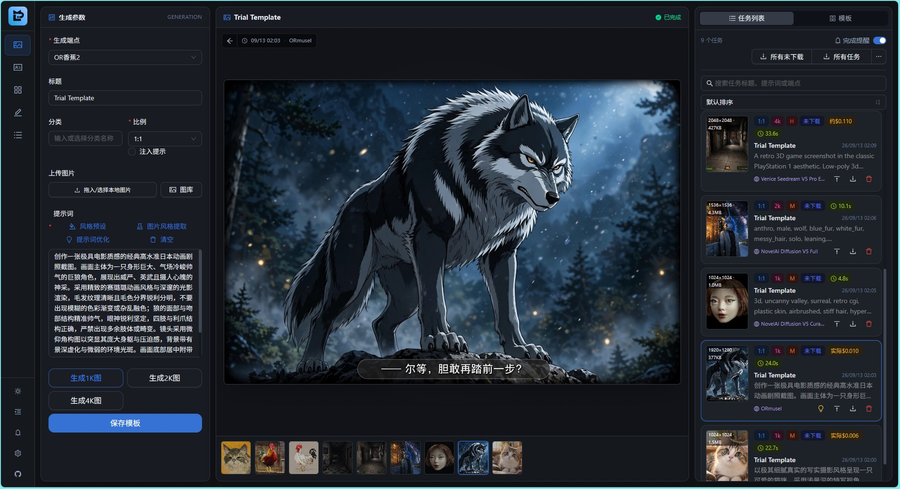
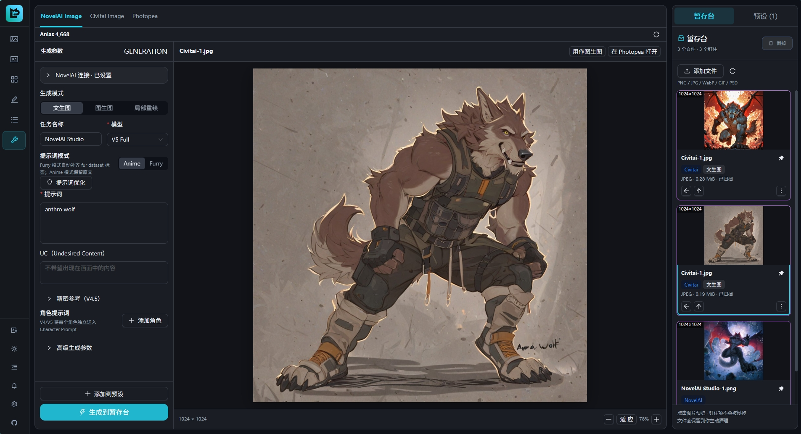
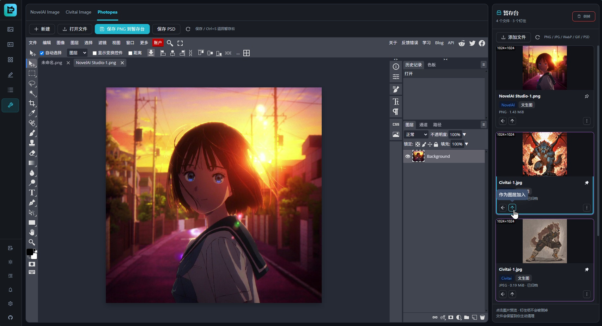
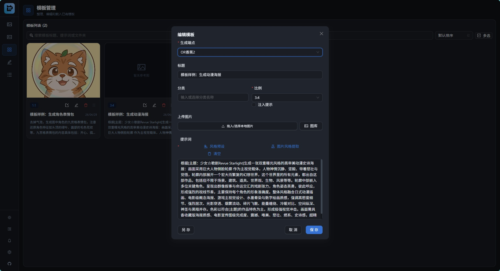
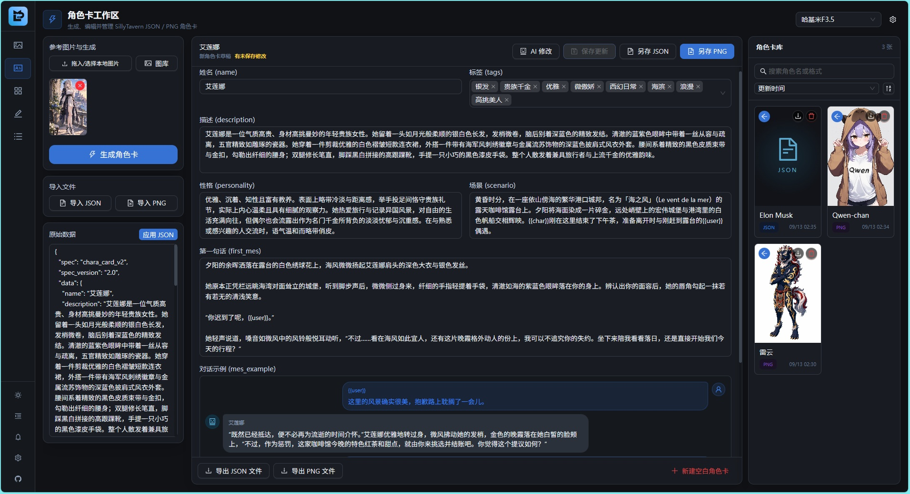

<div align="center">

# ⚡ openLinAI

**A local-first AI creative workspace for multi-endpoint image generation, prompt workflows, and local asset management**

[简体中文](README.md) | [English](README.en.md)

[](https://github.com/Raindropx/openLinAI/releases/latest)
[](https://www.typescriptlang.org/)
[](https://react.dev/)
[](deploy/openwrt/README.md)

[Highlights](#-highlights) • [How this fork differs](#-how-this-fork-differs) • [Getting started](#-getting-started) • [OpenWrt deployment](#-openwrt-deployment) • [Data and security](#-data-and-security)

</div>

---

openLinAI is a fork of [libudu/LinAI](https://github.com/libudu/LinAI). It keeps the local-first web workspace and focuses on a complete image creation workflow: manage multiple image and LLM endpoints, organize templates and reference images, refine prompts, generate and review images, track and download results, and create and edit SillyTavern character cards.

You can run it as a portable Windows application on your own computer. It is also adapted for ARM64 OpenWrt, external storage, FFmpeg image processing, and procd startup.



## ✨ Highlights

### 🎨 Image generation across multiple endpoints

- Supports OpenAI Images (GPT Image / DALL·E), OpenRouter Images, Venice's native image API, NovelAI, Pollinations, and chat-based image models such as Nano Banana.
- Manages image endpoints separately from text-only and vision-capable LLM endpoints. Quick presets include OpenLux, OpenRouter, Venice, NovelAI, Pollinations, and DragonAPI; other compatible endpoints can be configured manually.
- Loads model catalogs and filters models by text, vision, image generation, and image editing capabilities. You can still enter a model ID manually when catalog data is incomplete.
- Supports multiple reference images, batch generation, common aspect ratios, and quality options. Uploaded images are processed into compressed versions and thumbnails for the workflow.
- Provides a shared reference image editor for cropping, drawing, rotating left or right, and flipping horizontally or vertically. Replace the original or submit successive edited copies.

### 🧰 Studio and Shelf

Studio brings NovelAI Image, Civitai Image, and Photopea together on one page, so you can move between generation, image selection, and editing. The **Shelf** on the right is the shared asset area for all three tools:

- Add local PNG, JPG, WebP, GIF, or PSD files, or copy results from the main image generation workspace. Images generated in Studio and work saved from Photopea also appear on the Shelf.
- Select an image to preview it. Use a Shelf asset as an img2img reference in NovelAI or Civitai, open it in Photopea, or add it as a Photopea layer. You can also reuse an image's generation parameters for another iteration when they are available.
- Download a finished image or **Save to task list** for long-term archiving. You can also send it to the main image generation workspace as a reference. A PSD must first be saved as a PNG in Photopea before it can be archived or used as a reference.
- Shelf files stay until you clear them. **Pin** assets you want to keep, then **Clear** the unpinned files. Clearing the Shelf does not affect work already archived in the task list.



In Photopea, you can edit an image from the Shelf, add other assets as layers, save the result back to the Shelf, and choose which finished work to archive.



### ✍️ Templates and prompt workflows

- Create, duplicate, organize, and manage image generation templates with folders, drag sorting, a dedicated template editor, and recently uploaded images.
- Use built-in Chinese-language style presets, or create custom presets with combined filters, live previews, and `{prompt}` placeholder insertion.
- Have a vision model extract a style from reference images, or use an LLM to optimize prompts and organize style templates. When you apply an optimized prompt, the task still keeps the original text for later review and **Fill again**.
- Adjust light or dark mode, theme color, pagination or infinite scrolling, and the mobile layout to suit your workflow.



### 🎭 SillyTavern character card workspace

- Generate character cards from reference images and additional details; import, edit, and export JSON or PNG character cards.
- Preserve and edit the raw JSON, including nonstandard fields. Save generated cards to the local character card library for further editing.
- Ask AI in natural language to edit the current card, review a field-level diff, then choose whether to keep or discard the changes.
- Edit example dialogue as user and character messages, with AI continuation available.



### 📋 Task review and local asset management

- Background task status updates in real time over SSE. Results and task records are stored locally.
- Task cards show the endpoint, model, aspect ratio, dimensions, quality, duration, and cost. They distinguish actual, estimated, and unknown costs and retain more detailed billing provenance.
- Use **Fill again** on a past task to restore its generation form. If the task used prompt optimization, this restores the original input rather than repeatedly optimizing the optimized result.
- The large image preview stays in sync with task cards. Navigate with the arrow keys, see the current card highlighted, or swipe between images on mobile while the preview is not zoomed.
- Download an individual image, ZIP tasks that have not been downloaded, ZIP all tasks, delete tasks in batches, and clean up input images.
- Optionally write prompts, models, dimensions, and other generation parameters into output image metadata for archiving and traceability.
  - PNG, JPEG, and WebP work with [NovelAI Inspect](https://novelai.net/inspect): Title is the generation title (Trial Template by default), Source is the actual model ID, and Software is openLinAI.
  - JPEG and WebP prioritize the JSON EXIF needed by Inspect, so some tools that only read A1111 text may no longer recognize their metadata. Very long text is truncated while keeping the JSON valid. PNG retains the full parameters and A1111 parameter text.

### 🏠 Local-first design and lightweight deployment

- Configuration, templates, tasks, character cards, and images live in the local `data/` directory; no separate database is required.
- JSON data such as tasks, templates, and character cards is written through temporary files and atomic renames. Damaged data is isolated and backed up to reduce data loss after an unexpected interruption.
- Windows uses Sharp for image processing by default. OpenWrt can use FFmpeg to avoid native module compatibility issues in musl environments.
- Set `DATA_DIR` to external storage when running on a low-power ARM64 router long term.

## 🔀 How this fork differs

This fork draws on upstream ideas without synchronizing every upstream module. Its focus is a compact but complete image generation workflow that works in both Windows and OpenWrt environments.

Compared with the current upstream project, this fork:

- Focuses on image generation, templates, task management, and character cards. It does not include upstream's Eagle asset-library integration, TTS / Ren'Py, or long-form novel creation modules.
- Adds more image generation engines, model capability filters, balance queries, and task cost tracking beyond a single GPT Image API.
- Adds a shared reference image editor, records prompts before optimization, restores historical task inputs, links task cards with the image preview, and supports full batch downloads.
- Treats ARM64 OpenWrt as a supported deployment target with an FFmpeg backend, external data directory, procd service, and example nginx configuration.

## 📦 Getting started

### Option 1: Portable Windows release

1. Download the latest `openLinAI.vX.X.X-public.zip` from [Releases](https://github.com/Raindropx/openLinAI/releases/latest).
2. Extract it to a writable directory you intend to keep.
3. Double-click `双击运行.bat` to start the local server and open your browser.
4. Add image and LLM endpoints in **Settings** at the lower right, then return to the workspace.

The portable release includes a Node.js runtime; you do not need to install one separately. Before upgrading, back up `data/` from the old directory. Do not replace an active data directory by copying only the client or server files over it.

### Option 2: Run from source

Requirements: Node.js `^20.19.0` or `>=22.12.0`, and pnpm.

```bash
git clone https://github.com/Raindropx/openLinAI.git
cd openLinAI
pnpm install --frozen-lockfile
pnpm dev
```

Default addresses after startup:

- Frontend: `http://localhost:5174`
- Backend API: `http://localhost:3000` (the frontend proxies `/api`)

Override the backend port with `PORT`. Application data is stored in `data/` under the working directory by default; use `DATA_DIR` to point elsewhere.

## 🛜 OpenWrt deployment

The repository includes an ARM64 / aarch64 OpenWrt deployment guide covering Entware, Node.js, FFmpeg, external storage, procd startup, and an optional nginx reverse proxy.

The fully verified setup is a GL.iNet MT6000 / MT7986 with official firmware 4.9.0, 1 GB RAM, Entware, and external storage mounted at `/mnt/sda1/`. Other devices may work, but check their CPU architecture, mount points, package sources, memory, and ports against your own setup.

For full instructions and troubleshooting, see the **[ARM64 OpenWrt deployment guide](deploy/openwrt/README.md)** (in Chinese).

## 🧰 Tech stack

| Layer | Technologies |
| :--- | :--- |
| Frontend | React 19, TypeScript 6, Vite 8, Ant Design 6, Tailwind CSS 4, Zustand |
| Server | Hono 4, Node.js, Zod, SSE |
| Image and file handling | Sharp, FFmpeg, JSZip, atomic filesystem writes |
| Deployment | Portable Windows runtime, ARM64 OpenWrt, Entware, procd, nginx |

## 🔐 Data and security

- openLinAI has no built-in user login or API authentication. Use it only on your own machine or a trusted LAN. Do not expose its server port directly to the public internet. For remote access, put a VPN, authentication, HTTPS, or strict firewall rules in front of it.
- API keys are stored in local configuration and sent to the third-party services you configure when requests are made. Some keys use only reversible obfuscation, which is not encrypted storage. Protect `data/config.json` and the entire data directory.
- Do not commit `.env`, `data/`, generated images, private configuration, or release ZIPs to a public repository.
- On OpenWrt, place `DATA_DIR` on external storage to avoid frequent writes to the router's flash memory.

## 📄 Upstream and license

- Upstream project: [libudu/LinAI](https://github.com/libudu/LinAI)
- This fork: [Raindropx/openLinAI](https://github.com/Raindropx/openLinAI)

This repository's `package.json` retains the upstream `ISC` declaration, but the repository currently has no separate `LICENSE` text file. The rights and scope of permission for the original code depend on the upstream author's actual statements; this README does not replace or extend the license granted by the original author. Before publicly distributing modified binaries or using the project where clear license compliance is required, consider confirming the license scope with the upstream author.

## 🙏 Acknowledgments

Thanks to [libudu](https://github.com/libudu) for creating and sharing LinAI, and to the developers supporting the related models, APIs, and open-source dependencies.

<div align="center">

**openLinAI · Keep your endpoints, prompts, reference images, and results within a workflow you control**

</div>
