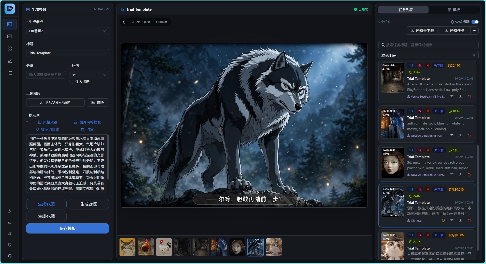
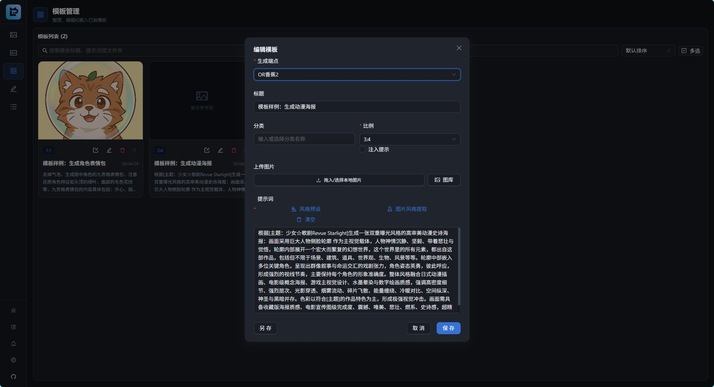
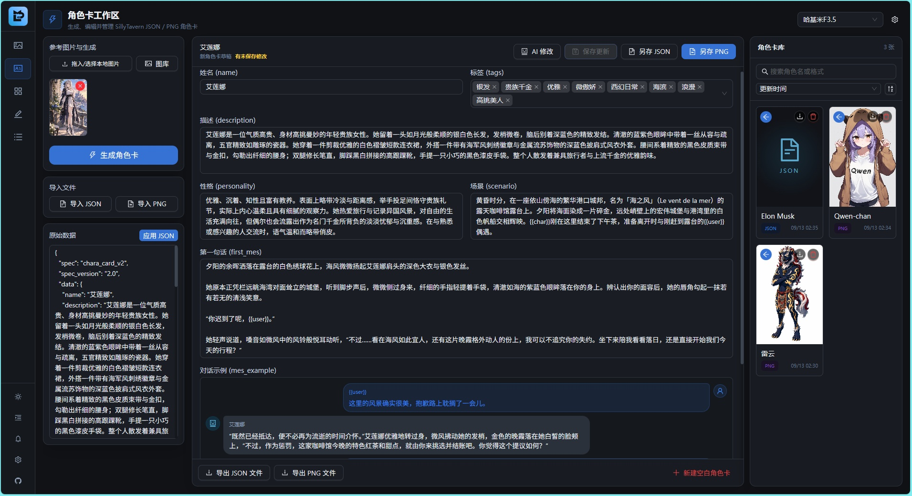

<div align="center">

# ⚡ openLinAI

**面向多端点生图、提示词工作流与本地资产管理的 Local-First AI 创作台**

[](https://github.com/Raindropx/openLinAI/releases/latest)
[](https://www.typescriptlang.org/)
[](https://react.dev/)
[](deploy/openwrt/README.md)

[功能亮点](#-功能亮点) • [与上游的差异](#-与上游的差异) • [快速上手](#-快速上手) • [OpenWrt 部署](#-openwrt-部署) • [数据与安全](#-数据与安全)

</div>

---

openLinAI fork 自 [libudu/LinAI](https://github.com/libudu/LinAI)，保留了本地优先的 Web 工作台形态，并将重心收束到一套完整的图片创作闭环：管理多个生图与 LLM 端点，组织模板和参考图，优化提示词，生成、审阅、追踪并下载图片，同时提供 SillyTavern 角色卡生成与编辑能力。

它既可作为 Windows 绿色应用在个人电脑上运行，也针对 ARM64 OpenWrt、外接存储、FFmpeg 图片处理与 procd 自启动进行了专门适配。



## ✨ 功能亮点

### 🎨 多端点图片生成

- 支持 OpenAI Images（GPT Image / DALL·E）、OpenRouter Images、Venice 原生图片接口、NovelAI、Pollinations，以及 Nano Banana 等聊天式图片生成模型。
- 图片端点与纯文本 / 视觉 LLM 端点分开管理；内置 OpenLux、OpenRouter、Venice、NovelAI、Pollinations、DragonAPI 等快捷预设，也可配置其他兼容端点。
- 支持读取模型目录，并按文本、视觉、图片生成和图片编辑能力筛选；目录信息不完整时仍可手动填写模型 ID。
- 支持多张参考图、批量出图、常用比例与画质选项；上传图片会生成适合工作流使用的压缩图和缩略图。
- 参考图内置统一编辑器，可在一个窗口中完成裁剪、涂鸦、左右旋转和水平 / 垂直翻转；可替换原图，也可连续提交编辑副本。

### ✍️ 模板与提示词工作流

- 创建、复制、分类和管理生图模板，支持文件夹、拖动排序、独立模板编辑器与最近上传图片。
- 内置中文风格预设，并支持创建自定义预设、组合筛选、实时预览和 `{prompt}` 占位注入。
- 可让视觉模型从参考图中提取风格，也可让 LLM 优化提示词或整理风格模板；采纳优化结果后仍会为对应任务保留优化前文本，方便回看和重新填入。
- 明暗主题、主题色、分页 / 无限滚动与移动端布局均可按使用习惯调整。



### 🎭 SillyTavern 角色卡工作区

- 根据参考图和补充设定生成角色卡，支持导入、编辑和导出 JSON / PNG 角色卡。
- 保留并编辑原始 JSON，可兼容非标准字段；生成后的角色卡可进入本地卡库继续维护。
- 支持用自然语言让 AI 修改当前设定，以字段级 DIFF 审阅结果后再选择保留或丢弃。
- 示例对话支持用户 / 角色气泡编辑与 AI 续写。



### 📋 任务审阅与本地资产管理

- 后台任务状态通过 SSE 实时更新，生成结果和任务记录在本地持久化。
- 任务卡展示端点、模型、比例、尺寸、画质、耗时和费用；支持实际费用、估算费用与未知费用的区分，并保留更详细的计费来源。
- 可从历史任务一键重新填入生成表单；若任务采用过提示词优化，会恢复优化前的原始输入，避免把优化结果重复优化。
- 大图预览与任务卡保持联动，支持键盘方向键切换、当前卡片高亮和移动端未缩放时滑动切图。
- 支持单图下载、未下载任务打包、全部任务打包、批量删除和输入图片清理。
- 可将提示词、模型、尺寸等生成参数写入输出图片元数据，方便归档和追溯。

### 🏠 Local-First 与轻量部署

- 配置、模板、任务、角色卡和图片均保存在本机 `data/` 目录，不依赖额外数据库。
- 任务、模板与角色卡等 JSON 数据采用临时文件加原子重命名写入；损坏数据会隔离备份，降低意外中断造成的数据丢失风险。
- Windows 默认使用 Sharp 处理图片；OpenWrt 可切换为 FFmpeg，避开 musl 环境中的原生模块兼容问题。
- `DATA_DIR` 可指向外接存储，适合让低功耗 ARM64 路由器长期运行。

## 🔀 与上游的差异

本 fork 会参考上游的优秀设计，但不会整仓同步所有模块。当前方向是保持生图工作流小而完整，并让 Windows 与 OpenWrt 两种运行环境都可实际落地。

相较当前上游，本 fork 的主要取舍是：

- 聚焦图片生成、模板、任务管理与角色卡，不包含上游现有的 Eagle 素材库联动、TTS / Ren'Py 和长篇小说创作模块。
- 扩展多种图片生成引擎、模型能力筛选、余额查询与任务费用追踪，而不只围绕单一 GPT Image 接口。
- 增加统一参考图编辑器、提示词优化前记录、历史任务重新填入、审阅卡片联动和完整批量下载等工作流能力。
- 将 ARM64 OpenWrt 作为正式支持的部署目标，提供 FFmpeg 后端、外接数据目录、procd 服务和 nginx 示例配置。

## 📦 快速上手

### 方式一：Windows 绿色版

1. 前往 [Releases](https://github.com/Raindropx/openLinAI/releases/latest) 下载最新的 `openLinAI.vX.X.X-public.zip`。
2. 解压到一个可长期保留、具有写入权限的目录。
3. 双击 `双击运行.bat`，应用会启动本地服务并打开浏览器。
4. 在右下角设置中添加图片端点与 LLM 端点，然后回到工作台开始使用。

绿色版自带 Node.js 运行时，无需另行安装。已有数据升级前建议先备份旧目录中的 `data/`；不要只复制前端或服务端文件后覆盖正在使用的数据目录。

### 方式二：从源码运行

前置环境：Node.js `^20.19.0` 或 `>=22.12.0`，以及 pnpm。

```bash
git clone https://github.com/Raindropx/openLinAI.git
cd openLinAI
pnpm install --frozen-lockfile
pnpm dev
```

启动后默认访问：

- 前端：`http://localhost:5174`
- 后端 API：`http://localhost:3000`，前端已配置 `/api` 代理

后端端口可通过 `PORT` 环境变量覆盖。应用数据默认位于运行目录下的 `data/`，可通过 `DATA_DIR` 指向其他位置。

## 🛜 OpenWrt 部署

仓库提供面向 ARM64 / aarch64 OpenWrt 的部署方案，涵盖 Entware、Node.js、FFmpeg、外接存储、procd 自启动和可选 nginx 反向代理。

目前完整验证环境为 GL.iNet MT6000 / MT7986、官方固件 4.9.0、1 GB RAM、Entware 和挂载于 `/mnt/sda1/` 的外部存储。其他设备可以参考，但必须按实际 CPU 架构、挂载点、软件源、内存和端口重新核对配置。

完整步骤与故障排查请阅读 **[ARM64 OpenWrt 部署指南](deploy/openwrt/README.md)**。

## 🧰 技术栈

| 层次 | 技术 |
| :--- | :--- |
| 前端 | React 19、TypeScript 6、Vite 8、Ant Design 6、Tailwind CSS 4、Zustand |
| 服务端 | Hono 4、Node.js、Zod、SSE |
| 图片与文件 | Sharp、FFmpeg、JSZip、文件系统原子写入 |
| 部署 | Windows 便携运行时、ARM64 OpenWrt、Entware、procd、nginx |

## 🔐 数据与安全

- openLinAI 没有内置用户登录或 API 访问鉴权，只适合在本机或可信局域网内使用。不要把服务端口直接暴露到公网；远程访问时应在前面增加 VPN、身份认证、HTTPS 或严格的防火墙策略。
- API Key 会保存在本地配置中，并在请求时发送给你配置的第三方服务。部分 Key 仅作可逆混淆，不应视为加密存储，请妥善保护 `data/config.json` 和整个数据目录。
- 不要把 `.env`、`data/`、生成图片、私有配置或发布压缩包提交到公共仓库。
- OpenWrt 部署建议将 `DATA_DIR` 放在外接存储上，避免频繁写入路由器 Flash。

## 📄 上游与许可证

- 上游项目：[libudu/LinAI](https://github.com/libudu/LinAI)
- 本 fork：[Raindropx/openLinAI](https://github.com/Raindropx/openLinAI)

本仓库 `package.json` 沿用上游的 `ISC` 声明，但仓库当前没有独立的 `LICENSE` 正文文件。原项目代码的权利与授权范围以上游作者的实际声明为准；本 README 不替代或扩展原作者授予的许可。公开分发修改版二进制文件或用于需要明确许可证合规的场景前，建议先向上游作者确认许可范围。

## 🙏 致谢

感谢 [libudu](https://github.com/libudu) 创建并公开 LinAI，也感谢所有为相关模型、接口和开源依赖提供支持的开发者。

<div align="center">

**openLinAI · 把端点、提示词、参考图与生成结果留在自己掌控的工作流里**

</div>
